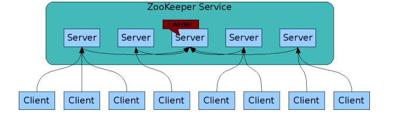
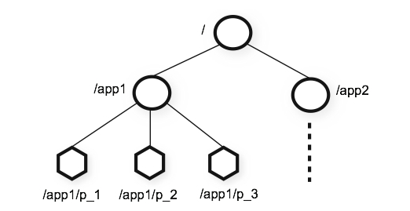
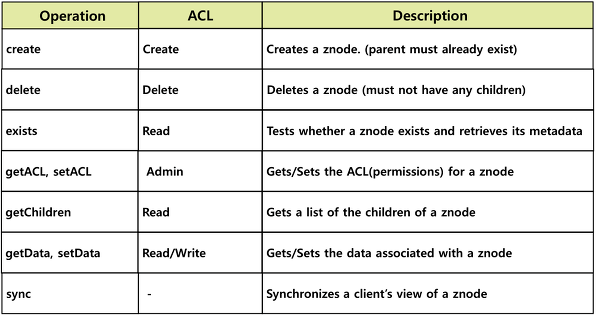
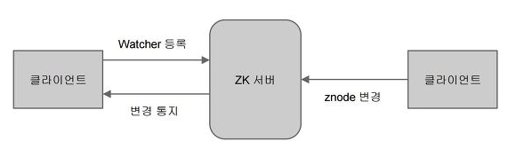

ZooKeeper란?
=====================================
주키퍼는 Apache 재단의 오픈소스 프로젝트 중 하나로 분산 시스템을 위한 코디네이터이다.

* 분산시스템이란
  - 복수의 컴퓨터가 네트워크를 통해 통신하며 하나의 목적을 위해 서로 간에 상호작용하는 것이다. 다수의 컴퓨터가 마치 하나인 것처럼 동작하는 시스템을 말한다.
  - 분산시스템을 구성할때 고려해야 할 사항으로는 서버든 간의 정보 공유, 동기화, 분산 서버들의 상태확인등이 필요하다.
* 분산 컴퓨팅에서의 코디네이션
  - 그룹 멤버십
  - 잠금제어
  - publisher/subscriber
  - 리더선정
  - 동기화
* zookeeper는 클러스터 구성원 간의 데이터 공유를 위한 데이터 스토리지(영속 데이터/임시 데이터), 클러스터 멤버십 관리르 통한 데이터 변경 통지, 마스터 및 분산 락 등에 활용되는 시퀀스 노드등을 제공한다. 이를 통해 다음에 활용할 수 있다.
  - 설정 관리
  - 분산 클러스터 관리
  - 명명 서비스(DNS)
  - 분산 동기화
  - 분산 시스템에서 리더 선출
  - 중앙집중형 신뢰성 있느 데이터 저장소
  
ZooKeeper 구성
-------------------------------------
주키퍼는 n개의 서버로 단일 주키퍼 클러스터를 구성하며 이를 서버 앙상블이라고 한다. 클라이언트는 앙상블에 속한 서버에 연결하여 서비스를
사용할 수 있다.

* zookeeper 서비스는 복수의 서버에 복제되며, 모든 서버는 데이터 카피본을 저장하고 있다.
- 리더는 구동 시 zookeeper 내부 알고리즘에 의해 자동 선정된다.
- followers 서버들은 클라이언트로부터 받은 모든 업데이트 이벤트를 리더에게 전달한다.
- 클라이언트는 모든 주키퍼 서버에서 읽을 수 있으며, 리더를 통해 쓸 수 있고 과반수 서버의 승인이 필요하다
  + 따라서 과반수를 유지하기 위해 보통 홀수개의 서버로 구성한다.
  
ZooKeeper 데이터모델
----------------------------------
주키퍼는 계층형 네임스페이스를 가지고 데이터를 저장한다. 데이터를 메모리상에 유지하여 높은 처리량과 낮은 지연률을 가능하게 하였다.

위 그림과 같이 계층형 구조를 가지고 각 계층의 네임 스페이스를 znode라고 한다. znode는 1M 이하의 데이터를 가질 수 있으며 자식 노드를 가질 수 있다.

영속 종류에 따라
* Persistent Nodes(영구 노드): 명시적으로 삭제되기 전까지 존재함
* Ephemeral Nodes(임시 노드): 세션이 유지되는 동안 활성(세션이 종류되면 삭제됨), 자식 노드를 가질 수 없음
* Sequence Nodes(순차 노드): 경로의 끝에 일정하게 증가하는 카운터가 추가됨, 영구 및 임시 노드 모두에 적용 가능

operation
-------------------------

주요 오퍼레이션으로는 create, delete, exists, getChilderen, getData, setData 등이 있다. 언어별 바인딩도 제공된다.

watch
-----------------------

Znode가 변경 시 trigger가 발생되 클라이언트는 이 변화를 알 수 있다.

> https://likefree.tistory.com/23
> https://alnova2.tistory.com/1044
