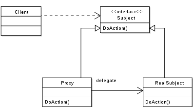

프록시 패턴이란?
==================================================
실제 기능을 수행하는 객체(Real Object) 대신 가상의 객체(Proxy Object)를 사용해 로직의 흐름을 제어하는 디자인 패턴

프록시 패턴의 특징
--------------------------------------------
* 원래 하려던 기능을 수행하며 그외의 부가적인 작업(로깅, 인증, 네트워크 통신 등)을 수행하기에 좋다
* 비용이 많이 드는 연산(DB 쿼리, 대용량 텍스트 파일 등)을 실제로 필요한 시점엣 수행 가능
* 사용자 입장에서는 프록시나 실제 객체나 사용법은 유사하기 때문에 사용성이 좋다

가상 프록시
-------------------------

가상 프록시는 실제 객체의 사용 시점을 제어할 수 있다. 

**예시**

텍스트 파일을 읽는 인터페이스
~~~
interface TextFile {
    String fetch();
}
~~~
암호화된 텍스트 파일을 복호화 하는 decodeByFileName
~~~
class SecretTextFile implements TextFile {
	private String plainText;

	public SecretTextFile(String fileName) {
		// 특별한 복호화 기법을 이용해 데이터를 복원해서 내용을 반환합니다.
		this.plainText = SecretFileHolder.decodeByFileName(fileName);
	}

	@Override
	public String fetch() {
		return plainText;
	}
}
~~~

만약 복호화 해야되는 파일이 20개가 되고 복호화에 걸리는 시간은 0.3초라고 한다면 사용자는 6초라는 긴 시간동안 결과값을 기다려야 된다.

이러한 문제점을 해결하기 위해 가상 프록시를 사용하게 된다.

~~~
class ProxyTextFile implements TextFile {
    private String fileName;
    private TextFile textFile;

    public ProxyTextFile(String fileName) {
        this.fileName = fileName;
    }

    @Override
    public String fetch() {
        if (textFile == null) {
            textFile = new SecretTextFile(fileName);
        }
        return "[proxy] " + textFile.fetch(); 
    }
}
~~~

~~~
void main() {
	List<TextFile> textFileList = new ArrayList<>();

	textFileList.addAll(TextFileProvider.getSecretTextFile(0, 3));
	textFileList.addAll(TextFileProvider.getProxyTextFile(3, 20));

  /// 딴 짓 
  
  
  // 필요할때 호출
	textFileList.stream().map(TextFile::fetch).forEach(System.out::println);
}
~~~
이처럼 3개만 미리 복호화를 해 1초만에 사용자에게 보여주고 나중에 필요한 시점에서 나머지 17개를 복호화를 통해 보여줄 수 있다.

보호 프록시
-------------------------------------
보호 프록시는 프록시 객체가 사용자의 실체 객체에 대한 접근을 제어한다.

**예시**

만약 기존의 인사정보 시스템이 있고 이를 직책에 따라 접근권한을 따로 부여하는 업무를 수행해야 된다고 하자
~~~
enum GRADE {
    Staff, Manager, VicePresident
}

// 구성원
interface Employee {
    String getName(); // 구성원의 이름
    GRADE getGrade(); // 구성원의 직책
    String getInformation(Employee viewer); // 구성원의 인사정보(매개변수는 조회자)
}

// 일반 구성원
class NormalEmployee implements Employee {
    private String name;
    private GRADE grade;

    public NormalEmployee(String name, GRADE grade) {
        this.name = name;
        this.grade = grade;
    }

    @Override
    public String getName() {
        return name;
    }

    @Override
    public GRADE getGrade() {
        return grade;
    }

    // 기본적으로 자신의 인사정보는 누구나 열람할 수 있도록 되어있다.
    @Override
    public String getInformation(Employee viewer) {
        return "Display " + getGrade().name() + " '" + getName() + "' personnel information.";
    }
}
~~~

이것을 프록시를 통해 접근권한을 설정하면

~~~
// 인사정보가 보호된 구성원(인사 정보 열람 권한 없으면 예외 발생)
class ProtectedEmployee implements Employee {
    private Employee employee;

    public ProtectedEmployee(Employee employee) {
        this.employee = employee;
    }

    @Override
    public String getInformation(Employee viewer) {
        // 본인 인사정보 조회
        if (this.employee.getGrade() == viewer.getGrade() && this.employee.getName().equals(viewer.getName())) {
            return this.employee.getInformation(viewer);
        }

        switch (viewer.getGrade()) {
            case VicePresident:
            	// 부사장은 조직장, 조직원들을 볼 수 있다.
                if (this.employee.getGrade() == GRADE.Manager || this.employee.getGrade() == GRADE.Staff) {
                    return this.employee.getInformation(viewer);
                }
            case Manager:
                if (this.employee.getGrade() == GRADE.Staff) { // 조직장은 조직원들을 볼 수 있다.
                    return this.employee.getInformation(viewer);
                }
            case Staff:
            default:
                throw new NotAuthorizedException(); // 조직원들은 다른 사람의 인사정보를 볼 수 없다.
        }
    }

    @Override
    public String getName() {
        return employee.getName();
    }

    @Override
    public GRADE getGrade() {
        return employee.getGrade();
    }
}

class NotAuthorizedException extends RuntimeException {
    private static final long serialVersionUID = -1714144282967712658L;
}
~~~

테스트를 해보면

~~~
public void main() {
	// 직원별 개인 객체 생성
    Employee CTO = new NormalEmployee("Dragon Jung", GRADE.VicePresident);
    Employee CFO = new NormalEmployee("Money Lee", GRADE.VicePresident);
    Employee devManager = new NormalEmployee("Cats Chang", GRADE.Manager);
    Employee financeManager = new NormalEmployee("Dell Choi", GRADE.Manager);
    Employee devStaff = new NormalEmployee("Dark Kim", GRADE.Staff);
    Employee financeStaff = new NormalEmployee("Pal Yoo", GRADE.Staff);

    // 직원들을 리스트로 가공.
    List<Employee> employees = Arrays.asList(CTO, CFO, devManager, financeManager, devStaff, financeStaff);

    System.out.println("================================================================");
    System.out.println("시나리오1. Staff(Dark Kim)가 회사 인원 인사 정보 조회");
    System.out.println("================================================================");

    // 자신의 직급에 관계 없이 모든 직급의 인사 정보를 열람 (문제!!)
    printAllInformationInCompany(devStaff, employees);

    System.out.println("================================================================");
    System.out.println("보호 프록시 서비스를 가동.");
    System.out.println("================================================================");
    List<Employee> protectedEmployees = employees.stream().map(ProtectedEmployee::new).collect(Collectors.toList());

    System.out.println("================================================================");
    System.out.println("시나리오2. Staff(Dark Kim)가 회사 인원 인사 정보 조회");
    System.out.println("================================================================");
    printAllInformationInCompany(devStaff, protectedEmployees);

    System.out.println("================================================================");
    System.out.println("시나리오3. Manger(Cats Chang)가 회사 인원 인사 정보 조회");
    System.out.println("================================================================");
    printAllInformationInCompany(devManager, protectedEmployees);

    System.out.println("================================================================");
    System.out.println("시나리오4. VicePresident(Dragon Jung)가 회사 인원 인사 정보 조회");
    System.out.println("================================================================");
    printAllInformationInCompany(CTO, protectedEmployees);
}

public void printAllInformationInCompany(Employee viewer, List<Employee> employees) {
    employees.stream()
            .map(employee -> {
                try {
                    return employee.getInformation(viewer);
                } catch (NotAuthorizedException e) {
                    return "Not authorized.";
                }
            })
            .forEach(System.out::println);
}
~~~
이런식의 결과를 얻게 된다.
~~~
================================================================
시나리오1. Staff(Dark Kim)가 회사 인원 인사 정보 조회
================================================================
Display VicePresident 'Dragon Jung' personnel information.
Display VicePresident 'Money Lee' personnel information.
Display Manager 'Cats Chang' personnel information.
Display Manager 'Dell Choi' personnel information.
Display Staff 'Dark Kim' personnel information.
Display Staff 'Pal Yoo' personnel information.
================================================================
보호 프록시 서비스를 가동.
================================================================
================================================================
시나리오2. Staff(Dark Kim)가 회사 인원 인사 정보 조회
================================================================
Not authorized.
Not authorized.
Not authorized.
Not authorized.
Display Staff 'Dark Kim' personnel information.
Not authorized.
================================================================
시나리오3. Manger(Cats Chang)가 회사 인원 인사 정보 조회
================================================================
Not authorized.
Not authorized.
Display Manager 'Cats Chang' personnel information.
Not authorized.
Display Staff 'Dark Kim' personnel information.
Display Staff 'Pal Yoo' personnel information.
================================================================
시나리오4. VicePresident(Dragon Jung)가 회사 인원 인사 정보 조회
================================================================
Display VicePresident 'Dragon Jung' personnel information.
Not authorized.
Display Manager 'Cats Chang' personnel information.
Display Manager 'Dell Choi' personnel information.
Display Staff 'Dark Kim' personnel information.
Display Staff 'Pal Yoo' personnel information.
~~~

> https://jdm.kr/blog/235
