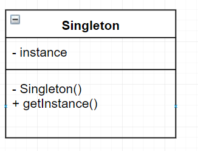

싱글톤 패턴이란
======================================================
* 객체를 하나만 생성하도록 하며, 생성된 객체를 어디에서든지 참조할 수 있도록 하는 패턴
* 생성 패턴의 한 종류이다.
 
* Singleton
  - 하나의 인스턴스만을 생성하는 책임이 있으며 getInstance 메서드를 통해 모든 클라이언트에게 동일한 인스턴스를 반환하는 작업을 수행한다.
  
프린터 예시
---------------------------------------------------
* 여러명이서 공유하는 프린터가 있다고 하자

~~~
public class Printer {
  public Printer() { }
  public void print(Resource r) { ... }
}

~~~

* 프린터는 하나이기 때문에 client에서 new printer()은 반드시 한번만 호출되어야 한다.
* 이를 해결하기 위한 방법은 외부에서 생성자를 호출할 수 없도록 하는 것이다.
 - 생성자를 public이 아니라 private으로 선언
 
 ~~~
 public class Printer {
  private Printer() { } // Printer 생성자를 외부에서 사용 불가
  public void print(Resource r) { ... }
}

 ~~~

* 자기 자신 프린터에 대한 인스턴스를 만들어 외부에 제공해줄 메서드가 필요하다.
 - static 메서드 / static 변수
  + 구체적인 인스턴스에 속하는 영역이 아니라 클래스 자체에 속한다.
  + 클래스의 인스턴스를 통하지 않고서도 메서드를 실행할 수 있고 변수를 참조할 수 있다.
  
~~~
public class Printer {
  // 외부에 제공할 자기 자신의 인스턴스
  private static Printer printer = null;
  private Printer() { }
  // 자기 자신의 인스턴스를 외부에 제공
  public static Printer getPrinter(){
    if (printer == null) {
      // Printer 인스턴스 생성
      printer = new Printer();
    }
    return printer;
  }
  public void print(String str) {
    System.out.println(str);
  }
}

~~~

>https://gmlwjd9405.github.io/2018/07/06/singleton-pattern.html
