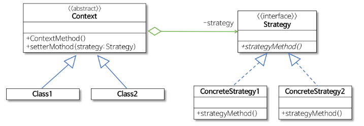
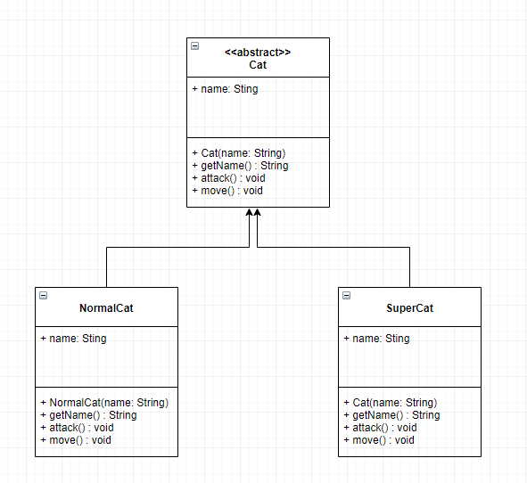

스트래티지 패턴
======================================

* 행위를 클래스로 캡슐화해 동적으로 행위를 자유롭게 바꿀 수 있게 해주는 패턴
  - 같은 문제를 해결하는 기능들이 클래스별로 캡슐화되어 있고 이들이 필요할 때 교체할 수 있도록 함으로써 동일한 문제를 다른 기능들로 해결할 수 있게 하는 디자인 패턴
  - 즉 전략을 쉽게 바꿀 수 있도록 해주는 디자인 패턴이다.
  - 특히 게임에서 캐릭터가 자신이 처한 상황에 공격이나 행동하는 방식을 바꾸고 싶을 때 스트래티지 패턴을 사용하는 것이 적합하다.
  
  
  
  
* Strategy
  - 인터페이스나 추상 클래스로 외부에서 동일한 방식으로 객체를 호출하는 방법을 명시
* ConcreteStrategy
  - Strategy에서 명시한 기능들을 실제로 구현한 클래스
* Context
  - 스트래티지 패턴을 이용하는 역할을 수행
  - 상황에 따라 구체적인 전략을 바꿀수 있도록 setter메소드를 제공
  
  

예시
--------------------------------------
 
 
 ~~~
	public abstract class Cat{
		private String name;
		public Cat(String name) {
			this.name=name;
		}
		
		public String getName() {
			return name;
		}
		
		public abstract void attack();
		public abstract void move();
	}
	
	public class NormalCat extends Cat{
		public NormalCat(String name) {
			super(name);
		}
		public  void attack() {
			System.out.println("보통 냥냥펀치");
		}
		public  void move() {
			System.out.println("보통 뛰기");
		}
	}
	
	public class SuperCat extends Cat{
		public SuperCat(String name) {
			super(name);
		}
		public  void attack() {
			System.out.println("슈퍼 냥냥펀치");
		}
		public  void move() {
			System.out.println("슈퍼 뛰기");
		}
	} 

~~~

~~~
public class Client {
	public static void main(String[] args) {
		Cat normalCat = new NormalCat("야옹이");
		Cat superCat = new SuperCat("슈퍼야옹이");
		
		System.out.println("My name is "+normalCat.getName());
		normalCat.move();
		normalCat.attack();
		
		System.out.println();
		System.out.println("My name is "+superCat.getName());
		superCat.move();
		superCat.attack();
		
	}
}
~~~

문제점
-----------------------------------------------------
* 기존의 고양이의 공격과 이동 방법을 수정할 경우
	- superCat을 노말 뛰기로 만든다면?
	- normalCat을 슈퍼 뛰기로 한다면?
	- 새로운 기능으로 변경하려고 코드를 수정해야 되므로 OCP에 위배된다.
	- superCat과 normalCat의 move 메서드의 내용이 중복된다.
	- 걷는 방식을 수정할려면 모든 중복 코드를 일관성있게 변경해야 된다.
	

해결책
------------------------------------------------------

무엇이 변화되었는지 찾은 후에 이를 클래스로 캡슐화해야 한다.
- 변화하면서 문제를 발생키는 요인은 이동 방식과 공격 방식의 변화이다.
- 이를 캡슐화 할려면 외부에 구체적인 이동 방식과 공격 방식을 담은 클래스들을 은닉해야 된다.
	* 공격과 이동을 위한 인터페이스를 각각 만들고 이들을 실제 실현할 클래스를 만들어야 한다.
 
 
- 구체적인 이동과 공격 방식이 MovingStrategy, AttackStrategy 인터페이스에 의해 캡슐화되어 있다.
- Strategy 패턴을 이용하면 새로운 기능의 추가가 기존의 코드에 영향을 미치치 못하게 하므로 OCP를 만족하는 설계가 된다.

