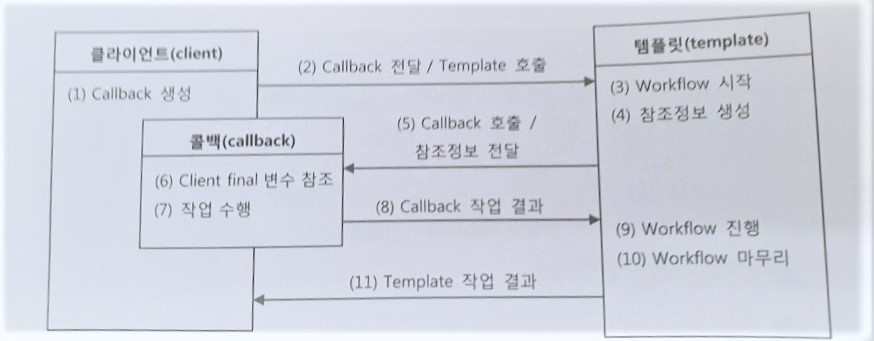

템플릿 패턴
====================================================================
* 어떤 작업을 처리하는 일부분을 서브 클래스로 캡슐화해 전체 일을 수행하는 구조는 바꾸지 않으면서 특정 단계에서 수행하는 내역을 바꾸는 패턴
  - 즉 전체적으로는 동일하면서 부분적으로는 다른 구문으로 구성된 메서드의 코드 중복을 최소화 할 때 유용하다.
  - 동일한 기능을 상위 클래스에 정의하면서 확장/변화가 필요한 부분만 서브 클래스에서 구현할 수 있도록 한다.
  - 행위 패턴의 하나
  

  
  
* 역할이 수행하는 작업
  - AbstractClass
    + 템플릿 메서드를 정의하는 클래스
    + 공통적인 기능들을 기술하고 하위 클래스에서 구현될 기능을 primitive 메서드 또는 hook 메서드로 정의하는 클래스
  - ConcreteClass
    + 물려받은 primitive 메서드 또는 hook 메서드를 구현하는 클래스
    + 부분적으로 다른 부분을 구현한다

예시
-----------------------
다음과 같이 JDBC를 사용하여 users라는 table 안의 데이터를 지우는 코드가 있다고 하자.

~~~
	Connection c = null;
		PreparedStatement ps =null;
		try {
			c = dataSource.getConnection();
		  
      
      //변하는 부분
			ps = c.prepareStatement("delete from users");
			
      
      ps.executeUpdate();
		} catch (Exception e) {
			// TODO: handle exception
			throw e;
		}
		finally {
			if(ps!=null) {try {
				ps.close();
			} catch (Exception e2) {
				// TODO: handle exception
				throw e2;
				} 
			}
			if(c!=null) {try {
				c.close();
			} catch (Exception e2) {
				// TODO: handle exception
				throw e2;
				}
			}
		}
~~~
삭제 뿐만 아니라 다른 CRUD 할려고 코드를 작성해보면  ps = c.prepareStatement("delete from users");
한 줄 외에는 다 공통적으로 코드가 같게 된다.

따라서 똑같은 코드를 중복해서 치는 것은 상당히 비효율적이므로 공통적인 부분을 abstractClass 에 선언하고
~~~
	public abstract class UserDao {

	public void deleteAll() throws SQLException {
		...
		try {
			c = dataSource.getConnection();
			
			ps = makeStatement(c);
			
			ps.executeUpdate();
			
		}
		...
	}

	public abstract PreparedStatement makeStatement(Connection c) throws SQLException();
	
	}

~~~
다른 부분만 상속을 통해 concreteClass에 선언을 한다.

~~~
public class UserDaoDeleteAll extends UserDao{
	
	public PreparedStatement makeStatement(Connection c) {
		PreparedStatement ps = c.prepareStatement("delete from users");
		return ps;
		
		}
}
~~~

문제점
--------------------------------------------------------------------
상속을 통해 코드가 중복되는 문제점을 막고 그럭저럭 OCP 원칙을 지키는 구조를 만들었다.

하지만 상속은 여러가지 문제점이 존재하는데

* Dao 로직마다 상속을 통해 새로운 클래스를 만들어야 한다.
	- JDBC 메소드가 100개일 경우 100개의 클래스가 만들어진다.
* 확장구조가 클래스를 설계하는 시점에서 고정되어 버린다.
	- 변하지 않는 코드를 가진 UserDao의 JDBC try/catch/finally 블록과 변하는 PreparedStatement를 담고 있는 서브클래스들이 이미 클래스 레벨에서 컴파일 시점에 관계가 결정되어 있다. 따라서 관계에 대한 유연성이 떨어져 버린다.
	
	
템플릿/콜백 패턴
---------------------------------------------------------------------------------
템플릿 패턴의 이러한 문제점들을 극복하고자 Strategy 패턴 기본 구조에 익명 내부 클래스를 활용하는 방식이 등장하는데 이게 바로 템플릿/콜백 패턴이라고 부른다. 전략 패턴의 컨텍스트를 템플릿이라 부르고, 익명 내부 클래스로 만들어지는 오브젝트를 콜백이라고 부른다.

* 템플릿
	- 템플릿(Template)은 어떤 목적을 위해 미리 만들어둔 모양이 있는 틀을 가리킨다. 프로그래밍에서는 고정된 틀 안에 바꿀 수 있는 부분을 넣어서 사용하는 경우에 템플릿이라고 부른다.
	- 템플릿 메소드 패턴은 고정된 틀의 로직을 가진 템플릿 메소드를 슈퍼클래스에 두고, 바뀌는 부분을 서브클래스의 메소드에 두는 구조로 이뤄진다.
	
* 콜백
	- 콜백(callback)은 실행되는 것을 목적으로 다른 오브젝트의 메소드에 전달되는 오브젝트를 말한다.
	- 파라미터로 전달되지만 값을 참조하기 위한 것이 아니라 특정 로직을 담은 메소드를 실행시키기 위해 상요한다.
	- 자바에서는 메소드 자체를 파라미터로 전달할 방법이 없기 때문에 메소드가 담긴 오브젝트를 전달한다. 그래서 functional object라고도 한다.
	

특징
--------------------------------------------------------------------------------
* 여러 개의 메소드르 가진 일반적인 인터페이스를 사용할 수 있는 Strategy 패턴과는 달리 템플릿/콜백 패턴의 콜백은 보통 단일 메소드 인터페이스를 사용한다.
	- 템플릿의 작업 흐름 중 특정 기능을 위해 한 번 호출되는 경우가 일반적이기 때문이다.
	- 콜백은 일반적으로 하나의 메소드를 가진 인터페이스를 구현한 익명 내부 클래스로 만들어진다.
* 콜백 인터페이스의 메소드에는 보통 파라미터가 있다.
	- 이 파리미터는 템플릿의 작업 흐름 중에 만들어지는 컨텍스트 정보를 전달받을 때 사용된다.
	
	

* 클라이언트에서는 템플릿 안에서 실행될 로직을 담은 콜백 오브젝트를 만들고, 콜백이 참조할 정보를 제공한다. 
* 템플릿은 정해진 작업 흐름을 따라 작업을 진행하다가 내부에서 생성한 참조정보를 가지고 콜백 오브젝트의 메소도를 호출한다. 콜백은 클라이언트 메소드에 있는 정보와 템플릿이 제공한 참조정보를 이용해서 작업을 수행하고 그 결과를 다시 템플릿에 돌려준다.
* 템플릿은 콜백이 돌려준 정보를 사용해서 작업을 마저 수행한다.

예시
--------------------------------------------------
파일을 열어서 모든 라인의 숫자를 더한 합을 구해주는 계산기를 구현해보자

~~~
public class Calculator {

	public Integer calcSum(String filepath) throws IOException{
		BufferedReader br=null;
		try{
			br = new BufferedReader(new FileReader(filepath));
			Integer sum =0;
			String line = null;
			while((line=br.readLine())!=null) {
				sum+=Integer.valueOf(line);
			}
			
			br.close();
			return sum;
		}
		catch(IOException e){
			throw e;
		}
		finally{
		if(br!=null){
		try{br.close();}
		catch(IOException e){}
		}
		}
		
	}
}
~~~
