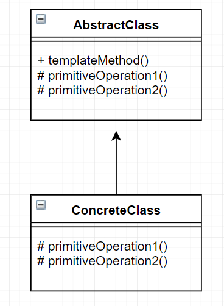

템플릿 패턴
====================================================================
* 어떤 작업을 처리하는 일부분을 서브 클래스로 캡슐화해 전체 일을 수행하는 구조는 바꾸지 않으면서 특정 단계에서 수행하는 내역을 바꾸는 패턴
  - 즉 전체적으로는 동일하면서 부분적으로는 다른 구문으로 구성된 메서드의 코드 중복을 최소화 할 때 유용하다.
  - 동일한 기능을 상위 클래스에 정의하면서 확장/변화가 필요한 부분만 서브 클래스에서 구현할 수 있도록 한다.
  - 행위 패턴의 하나
  

  
  
* 역할이 수행하는 작업
  - AbstractClass
    + 템플릿 메서드를 정의하는 클래스
    + 공통적인 기능들을 기술하고 하위 클래스에서 구현될 기능을 primitive 메서드 또는 hook 메서드로 정의하는 클래스
  - ConcreteClass
    + 물려받은 primitive 메서드 또는 hook 메서드를 구현하는 클래스
    + 부분적으로 다른 부분을 구현한다

예시
-----------------------
다음과 같이 JDBC를 사용하여 users라는 table 안의 데이터를 지우는 코드가 있다고 하자.

~~~
	Connection c = null;
		PreparedStatement ps =null;
		try {
			c = dataSource.getConnection();
		  
      
      //변하는 부분
			ps = c.prepareStatement("delete from users");
			
      
      ps.executeUpdate();
		} catch (Exception e) {
			// TODO: handle exception
			throw e;
		}
		finally {
			if(ps!=null) {try {
				ps.close();
			} catch (Exception e2) {
				// TODO: handle exception
				throw e2;
				} 
			}
			if(c!=null) {try {
				c.close();
			} catch (Exception e2) {
				// TODO: handle exception
				throw e2;
				}
			}
		}
~~~

