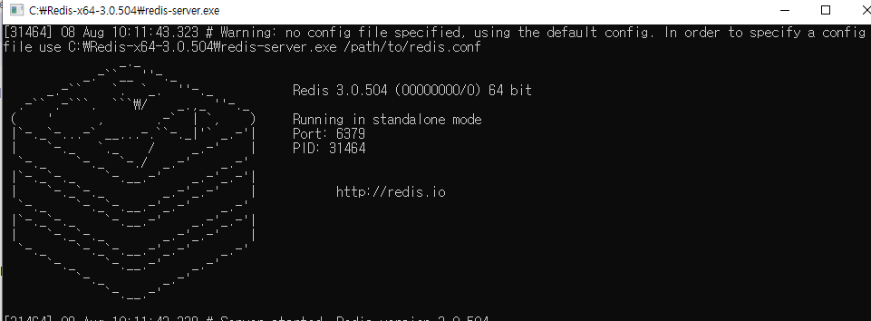
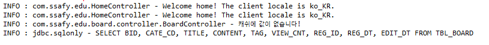
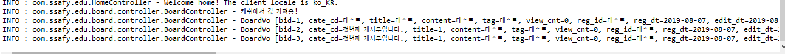

Redis 사용법!!!
=======================
윈도우 version
-----------------------
### redis는 key-value 형태의 데이터 저장소를 제공해주는 NoSQL의 일종이다. 캐쉬로 많이 쓰인다고 한다!

## 설치
1. [Redis다운](https://github.com/microsoftarchive/redis/releases/tag/win-3.0.504)

2. 압축을 풀어주고 나면 redis-cli, redis-server exe파일이 있다. redis-server를 실행하자!

3. 요렇게 나오면 성공!

## 적용해보기

1. 따로 패키지를 만든 후 SpringRdisConfig 클래스를 만들고 @Configuration 후 JedisConnectionFactory를 사용하기 위해
connectionFactory함수를 만들고 @Bean 설정 후 hostname과 port를 지정해준다.

2. RedisTemplate 사용을 위한 redisTemplate 함수를 만들고 @Bean 설정후 connectionFactory를 주입한다.

3. controller 부분에서 RedisTemplate을 선언한다. 그리고 resdisTemplate.opsForValue().get() 을 통해 key값으로 검색을 한다.

4. 만약 검색 결과가 null이라면 캐쉬에 값이 없다는 뜻이므로 service를 통해 데이터베이스에서 값을 가져온 후 캐쉬에 저장을 한다. null이
아니라면 데이터베이스에서 접속 할 필요 없이 캐쉬에서 값을 가져온다.

**캐쉬에 없을때**

**캐쉬에 있을때**

## 정리

일단 테스트 용으로 대충 짜긴 했는데 저런 식으로 구현할 시 데이터베이스 값이 변경될때 반영이 안되므로 따로 변경됨을 체크 할 수 있는 부분을 데이터베이스에 추가하거나 immutable한 객체에만 적용하는게 좋을 것 같다!

근데 의문점인게 트래픽을 분산해서 mysql의 부하를 줄일려고 캐쉬를 쓰는건데 redis도 NoSQL 기반의 데이터베이스고 redis로 트래픽이 많이 몰리면 어떻게 대처해야되는거지?? redis도 master-slave 분산DB구조로 해야되는건가??

